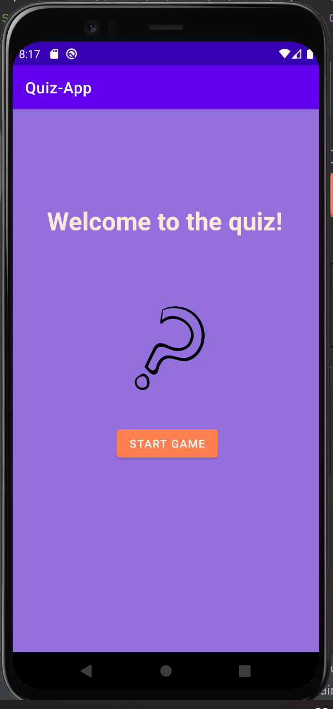
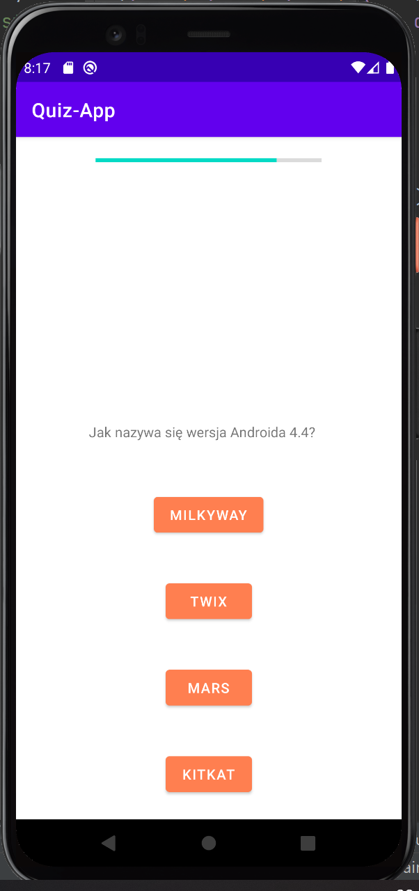
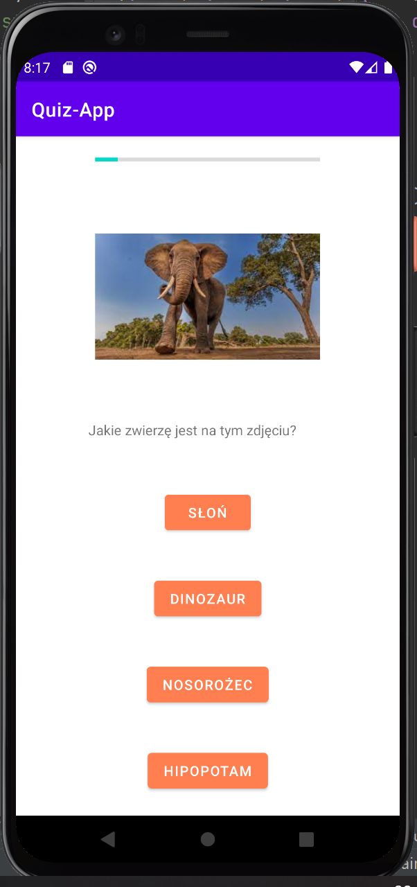
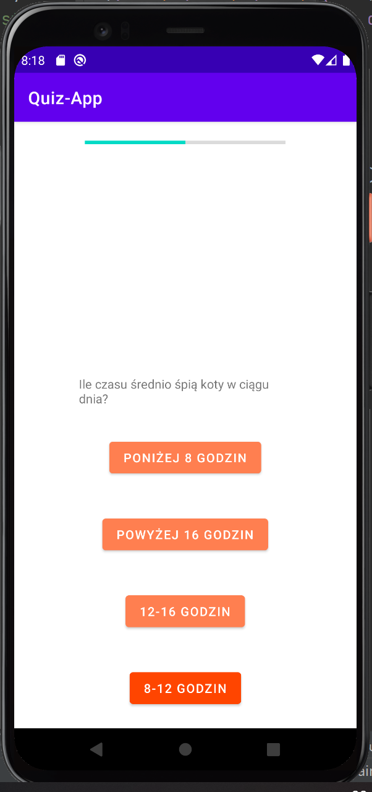
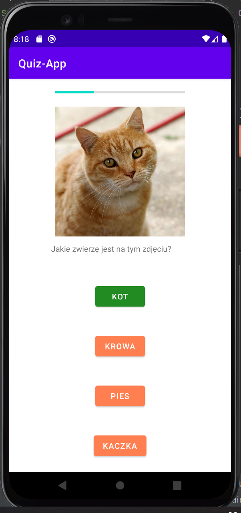

# QuizApp
Final project for 'Programming of mobile applications' course. Mobile game for Android.

__Author:__ Kacper Jach

# Description
QuizApp is question-based mobile game. Randomly selects 10 questions from predefined base of questions containing either text or image based questions. Answers are also displayed in random order for better experience. The game has points system and timer for each question: time left is calculated for additional points whereas no time left gives 0 points and automatically goes to next question.

# Technologies
* Java
* Android SDK 29

# IDE
Android Studio Arctic Fox 2020.3.1 Patch 3

# Screenshots
Starting activity of the game

Example of text-based question

Example of image-based question

Highlighting if player chose wrong answer

Highlighting if player chose right answer

Summary of played game with summed up points and number of answers player chose correctly

